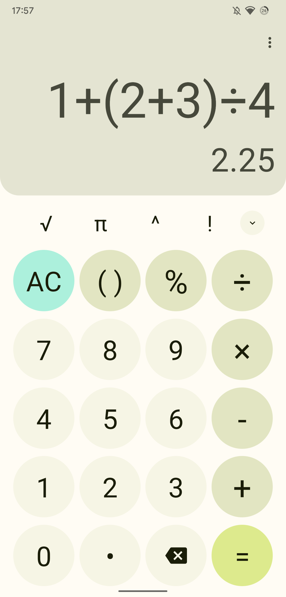
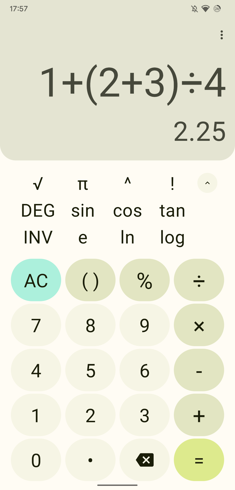
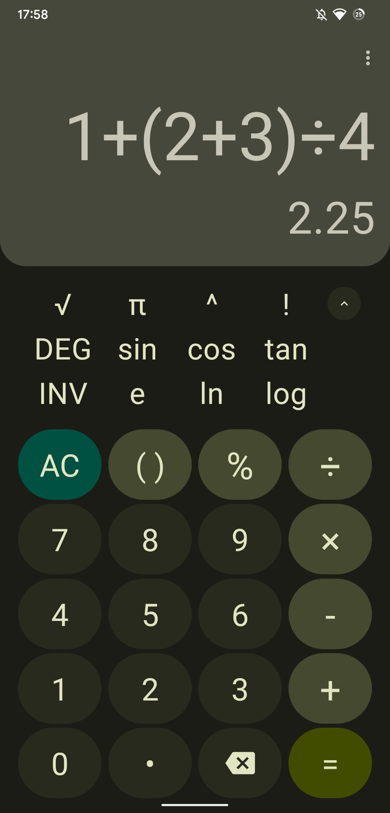

# Jetpack Compose 计算器

本项目是 [Compose 学习挑战赛](https://mp.weixin.qq.com/s/QdGJpmlNAHPfsUvcJi1zrA)的作品，UI 模仿自 Google 的计算器 APP，基于 Jetpack Compose，已实现基本四则运算功能。

## 特点

- 使用 Material You 设计风格。
- 实现动画效果。
- 适配深色模式。
- 适配沉浸式状态栏和导航栏。

## 界面截图

|  |  |  |  |
| ------------------------------------------------------ | ------------------------------------------------------ | ------------------------------------------------------ | ---------------------------------------------------------------------- |

## TODO

- [ ] 实现更多运算功能。
- [ ] 适配横屏。
- [ ] 实现历史记录。
